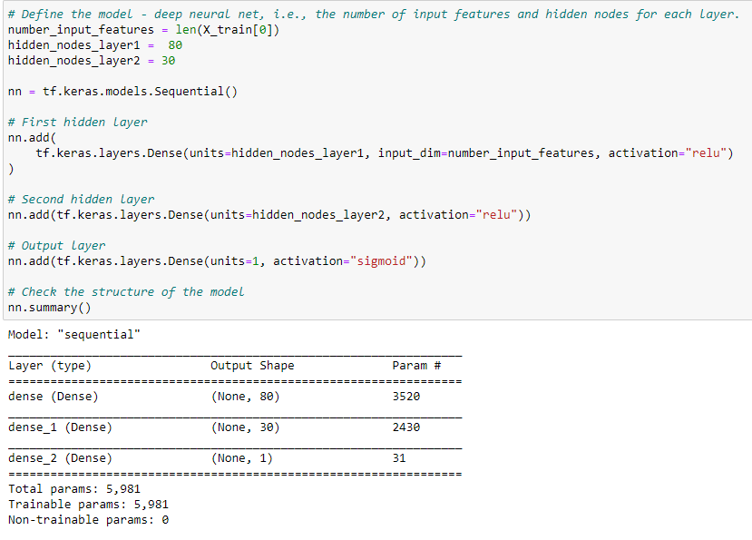
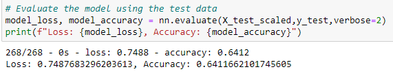
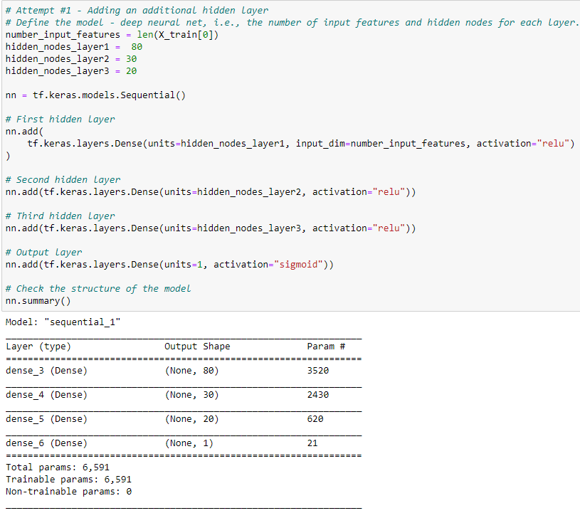
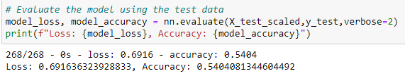
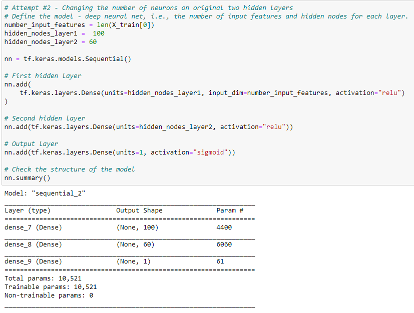
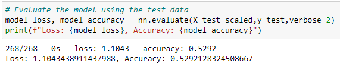
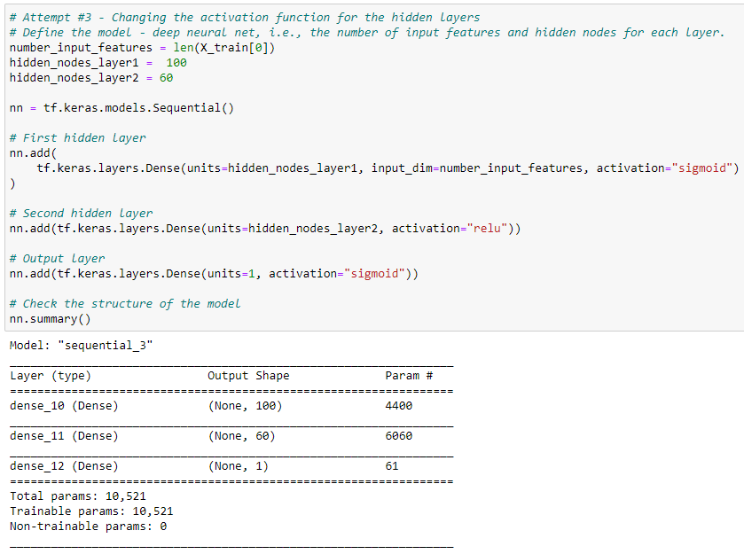
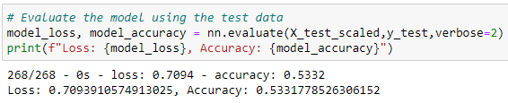

# Neural Network Charity Analysis

## Overview:

Using machine learning and neural networks, created a binary classifier that is capable of predicting whether applicants will be successful if funded by Alphabet Soup.

## Purpose:

Using machine learning and neural networks, created a binary classifier that is capable of predicting whether applicants will be successful if funded by Alphabet Soup.  Alphabet Soup's business team has provided a CSV file with more than 34,000 organizations that have received funding over the years.  

Task performed include:

1. Preprocessing data for a Neural Network Model

2. Compiling, Training, and Evaluating the Model

3. Optimizing the Model

## Results Summary

### Data Preprocessing
For this model, the target variable is the IS_SUCCESSFUL column data as this variable denotes if the organization effectively used the money received from Alphabet Soup.

The variables considered features for this model are:  

-- APPLICATION_TYPE—Alphabet Soup application type
-- AFFILIATION—Affiliated sector of industry
-- CLASSIFICATION—Government organization classification
-- USE_CASE—Use case for funding
-- ORGANIZATION—Organization type
-- STATUS—Active status
-- INCOME_AMT—Income classification
-- SPECIAL_CONSIDERATIONS—Special consideration for application
-- ASK_AMT—Funding amount requested

Two variables in the dataset, EIN and NAME, were neither targets nor features, because they were identification pieces of data  that would not be useful in or contribute to this model's prediction capability, were removed from the input data: 

### Compiling, Training, and Evaluating the Model
The model contains nine feature inputs (listed above), two hidden layers (the first layer with 80 neurons and the second with 30 neurons using the relu activation function), and an output layer (with 1 neuron using the sigmoid activation function).  The first two layers used the rectified linear unit (relu) activation funtions.  The relu activation function handles non-linear data and simplifies output better than other activation functions.  The output layer used a sigmoid activation function to produce a probability output.

#### Model Layers, Neurons, and Activation Functions

The model's target predictive accuracy of higher than 75% was not achieved and only an accuracy of 64% was achieved.

#### Model Evaluation

In an attempt to increase the model performance, the following steps were taken.  But in all cases, an accuracy of higher than 75% was not achieved:

1.  Addition of another hidden layer

#### Model Optimization Attempt #1: Layers, Neurons, and Activation Functions

#### Model Optimization Attempt #1:  Evaluation

2.  Removal of the added third hidden layer and increasing the number of neurons in the remaining two hidden layers

#### Model Optimization Attempt #2: Layers, Neurons, and Activation Functions

#### Model Optimization Attempt #2:  Evaluation

3.  Changing the activation function in the first layer

#### Model Optimization Attempt #3: Layers, Neurons, and Activation Functions

#### Model Optimization Attempt #3:  Evaluation

## Challenges and Difficulties Encountered
After three attempts, was not able to optimize the model to the greater than 75% accuracy target.

## Summary

Overall the neural network was not able to be optimized to perform better than the 75% predictive accuracy target.  The original model settings, following preprocessing, provided the best accuracy percentage (64%).  Three attempts were made to optimize the model, but each attempt resulted in even lower predictive accuracy percentages:  (1) Addition of another hidden layer = 54%; (2) Increasing the number of neurons with two hidden layers = 53%; (3) Changing the activation function in the first layer = 53%.  

Other optimization options, such as reducing the number of inputs or using a random forest classifier instead of a neural network, could potentially achieve a better predictive accuracy.  Using the random forest classifier enables ranking all the features to identify less important/impactful features that can be dropped and potentially increase the accuracy percentage.  Reducing the number of features could also reduce the risk of model overfitting.
